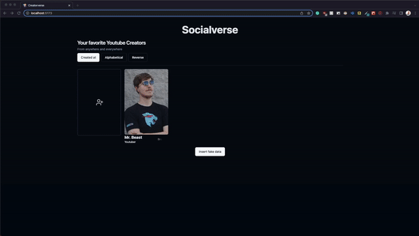

[Live site here](https://socialverse-blond.vercel.app/)

# Socialverse

Submitted by: Brody Pen

About this web app: An web app with your favorite youtube creators! Insert, delete, edit, and inspect youtube creators.

Time spent: 10 hours

## Required Features

The following **required** functionality is completed:

- [X] **A logical component structure in React is used to create the frontend of the app**
- [X] **At least five content creators are displayed on the homepage of the app**
- [X] **Each content creator item includes their name, a link to their channel/page, and a short description of their content**
- [X] **API calls use the async/await design pattern via Axios or fetch()**
- [X] **Clicking on a content creator item takes the user to their details page, which includes their name, url, and description**
- [X] **Each content creator has their own unique URL**
- [X] **The user can edit a content creator to change their name, url, or description**
- [X] **The user can delete a content creator**
- [X] **The user can add a new content creator by entering a name, url, or description and then it is displayed on the homepage**

The following **optional** features are implemented:

- [] Picocss is used to style HTML elements
- [X] The content creator items are displayed in a creative format, like cards instead of a list
- [X] An image of each content creator is shown on their content creator card

The following **additional** features are implemented:
- Tailwind CSS/ShadCN for response UI components and design
- Zod and React-hook-form for schema validation and performant form handling

## Video Walkthrough

Here's a walkthrough of implemented required features:

GIF created with obs and ezgif

## Notes

Describe any challenges encountered while building the app or any additional context you'd like to add.
- This was my first with a lot of technology. Vite, Zod, react-hook-form, and Supabase
- Main functionality was done in one day under 2-3 hours (Jun 26, 2023), I had a hard time finding time to focus on this during the summer.

What I learned from beginner bugs and bad mistakes include:
- .env requires "VITE_" before the api keys, etc. Oops
- Supabase insert/delete/update used to return a data object, but not anymore. This led to issues assuming data object exists.
- How to properly use a skeleton, you should render this on the client side as loadingContext as relative under the image. Images load bit by bit.
- React-hook-form "values" are not meant to have values already, to have values already in the input you should be using reset.

## License

Copyright [2023] [Brody Pen]

Licensed under the Apache License, Version 2.0 (the "License"); you may not use this file except in compliance with the License. You may obtain a copy of the License at

> http://www.apache.org/licenses/LICENSE-2.0

Unless required by applicable law or agreed to in writing, software distributed under the License is distributed on an "AS IS" BASIS, WITHOUT WARRANTIES OR CONDITIONS OF ANY KIND, either express or implied. See the License for the specific language governing permissions and limitations under the License.